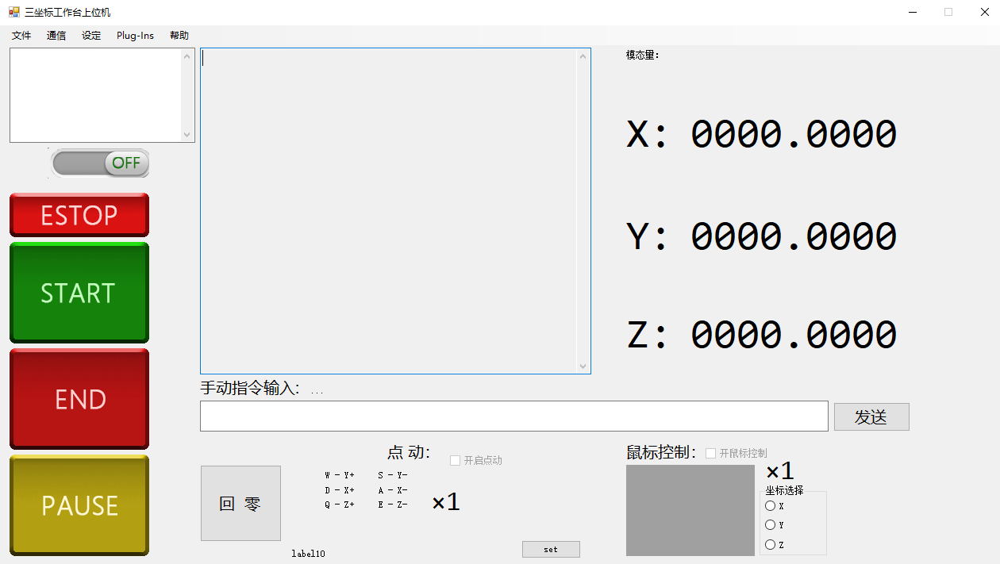

# Kinect_Worktable
We develop a mechatronic control system based on Kinect and 3-DOF worktable. The system obtains the real-time position of human key points from Kinect, and then records the trajectory of human hands. The trajectory will be converted to the G code (the command in numerically controlled machine) through our plug-in components, which guides the 3-DOF worktable to draw the same trajectory.

## KincectBodyBasics
Functions: The program is the upper system connected to Kinect device and the lower system. The Kinect records the real-time hands position. The upper system then processes the position data and encodes it to the lower system through serial communication. Meanwhile, the upper system obtains the feedback data from the lower system continously. The decoder module works to read understandable information.  

Components
- EncoderDecoder: The implementation of encoder and decoder for data tranlation between the upper system and the lower system.
- IEncoder: The interface of encoder and decoder.
- SerialControl: The serial communication between the upper system and the lower system.
- IPublicPlugInInterface: Encapsulate the interface of plug-in components. Any plug-in module inheriting this interface can be called by this program.
- HandControl: The interaction logic between human hands and the upper system.

## Worktable
Functions: Another upper system that provide debug 

Interface:

Components
- EncoderDecoder: The implementation of encoder and decoder for data tranlation between the upper system and the lower system.
- IEncoder: The interface of encoder and decoder.
- SerialControl: The serial communication between the upper system and the lower system.
- IPublicPlugInInterface: Encapsulate the interface of plug-in components. Any plug-in module inheriting this interface can be called by this program.
- HandControl: The interaction logic between human hands and system.

